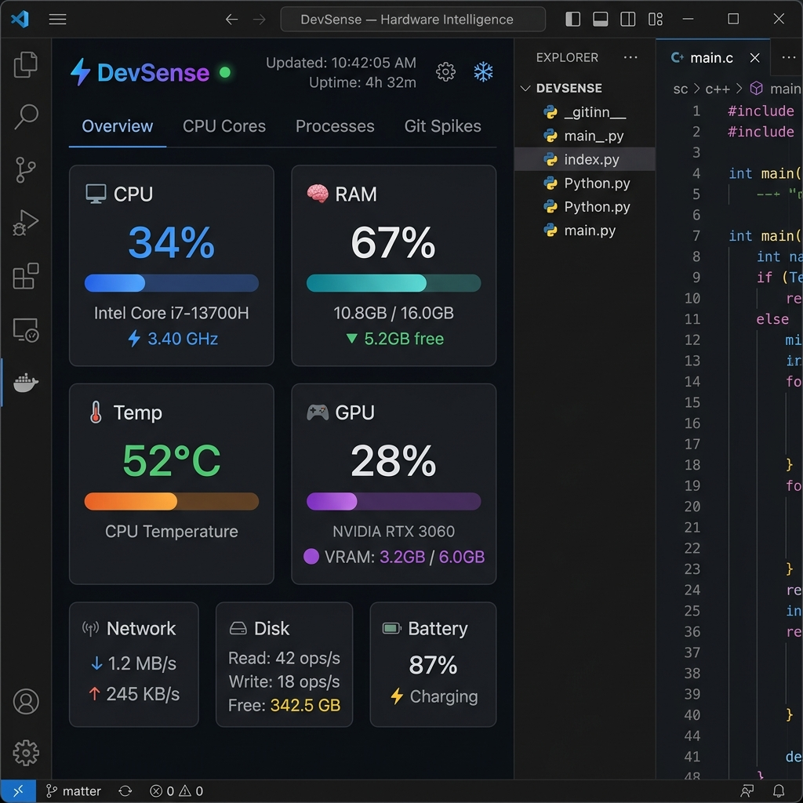
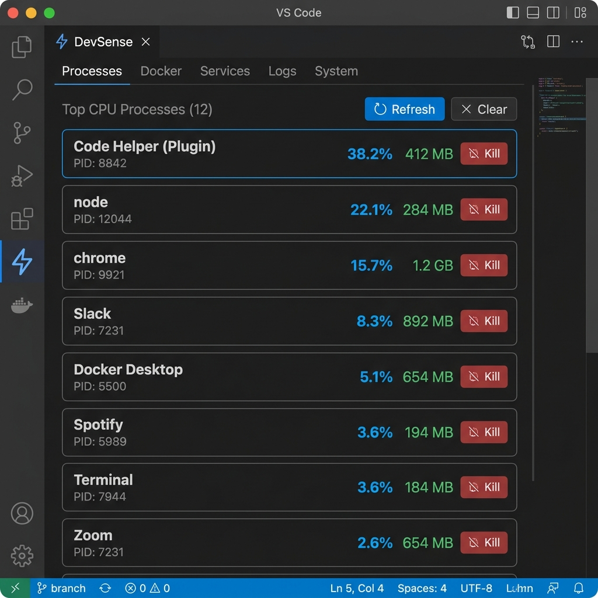
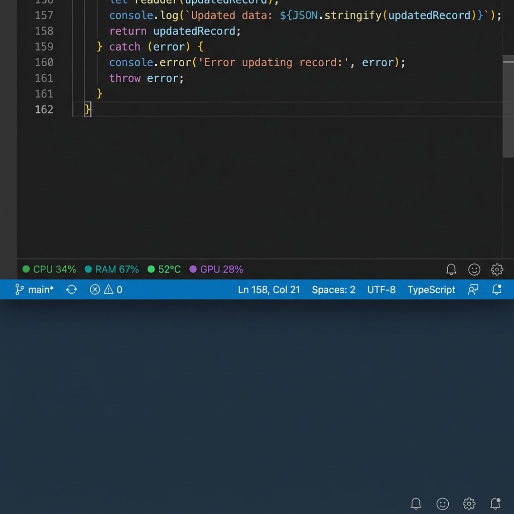

# ⚡ DevSense — Hardware Intelligence for VS Code

[](https://open-vsx.org/extension/devsense-team/devsense)
[](https://open-vsx.org/extension/devsense-team/devsense)
[](https://opensource.org/licenses/MIT)
[](https://open-vsx.org/extension/devsense-team/devsense)

> **Real-time CPU, RAM, GPU & temperature monitoring built directly into your IDE — nothing like this exists anywhere else.**

DevSense transforms VS Code, VSCodium, Gitpod, and Eclipse Theia into a **hardware-aware development environment**. Monitor your machine's full hardware vitals in real-time and let DevSense automatically adapt your workflow when your system is under stress.

---

## 📸 Screenshots

### 📊 Live Hardware Dashboard


### 📋 Process Manager — Kill runaway processes in one click


### 🔴 Status Bar Vitals — Always visible hardware health


---

## 🚀 Quick Start

**Step 1** — Install DevSense from [Open VSX Registry](https://open-vsx.org/extension/devsense-team/devsense)

```bash
# Install via CLI (VSCodium / Gitpod / Theia)
ovsx get devsense-team.devsense
```

**Step 2** — The **⚡ icon** appears in your Activity Bar instantly

**Step 3** — **Click the ⚡ icon** to open the live Hardware Dashboard

**Step 4** — Hardware vitals appear in your **Status Bar** automatically — no config needed!

---

## ✨ Features

### 📊 Live Hardware Dashboard
A premium dark-themed sidebar panel with animated real-time charts:
- **CPU** — usage %, clock speed (GHz), per-core breakdown
- **RAM** — usage %, used/total GB, free GB indicator
- **GPU** — usage %, VRAM used/total
- **Temperature** — smart color-coded (🟢 safe → 🔴 critical)
- **Disk** — read/write speed + free space
- **Network** — live download/upload speed
- **Battery** — level & charging status

### 🔴 Status Bar Vitals
Always-visible hardware health — color-coded at a glance:
- 🟢 Normal &nbsp;|&nbsp; 🟡 Warning &nbsp;|&nbsp; 🔴 Critical

### ⚡ Smart Anomaly Detection
Fires **intelligent, actionable notifications** when:
- CPU > 80% sustained
- RAM > 85% used
- CPU temperature > 80°C
- GPU temperature > 85°C
- Battery < 15% and not charging

### 🧊 Lite Mode
When sustained stress is detected, DevSense automatically activates **Lite Mode** — suspending heavy extensions to free up resources. Auto-disables when stress resolves. One-click disable from the banner.

### 📋 Process Manager
View **top CPU-consuming processes** directly inside VS Code. One click to terminate any runaway process.

### 🔗 Git Spike Correlation
Every hardware spike is linked to your **current git commit** — trace performance regressions directly to code changes. Copy commit hash in one click 📋.

### ⚙️ Settings Button
Jump directly into DevSense settings from the dashboard header — no manual searching required.

---

## ⚙️ Configuration

| Setting | Default | Description |
|---------|---------|-------------|
| `devsense.updateInterval` | `2000` | Polling interval in ms (min 500) |
| `devsense.cpuWarningThreshold` | `80` | CPU % warning threshold |
| `devsense.ramWarningThreshold` | `85` | RAM % warning threshold |
| `devsense.tempWarningThreshold` | `80` | Temperature °C warning threshold |
| `devsense.liteModeAutoTrigger` | `true` | Auto-enable Lite Mode under stress |
| `devsense.showStatusBar` | `true` | Show hardware vitals in status bar |
| `devsense.enableNotifications` | `true` | Enable smart hardware notifications |

---

## 💻 Commands

| Command | Shortcut | Description |
|---------|----------|-------------|
| `DevSense: Open Hardware Dashboard` | Activity Bar ⚡ | Open the live dashboard |
| `DevSense: Toggle Lite Mode` | Dashboard header 🧊 | Toggle Lite Mode on/off |
| `DevSense: Open Process Manager` | Processes tab | View & kill processes |
| `DevSense: Refresh Hardware Data` | Dashboard header ↻ | Force a hardware refresh |

---

## 🌍 Platform Support

| Platform | Status |
|----------|--------|
| ✅ Windows 10/11 | Fully supported |
| ✅ macOS 12+ | Fully supported |
| ✅ Linux (Ubuntu, Fedora, Arch) | Fully supported |

---

## 🔌 Compatible Editors

DevSense is natively available on **Open VSX** — no manual `.vsix` installation needed:

| Editor | Install Method |
|--------|---------------|
| **VSCodium** | Extensions panel → search `DevSense` |
| **Gitpod** | Open VSX auto-sync |
| **Eclipse Theia** | Extensions panel → search `DevSense` |
| **VS Code** | Open VSX or direct `.vsix` install |

---

## 📄 License

MIT © DevSense Team — [Open VSX Page](https://open-vsx.org/extension/devsense-team/devsense)
